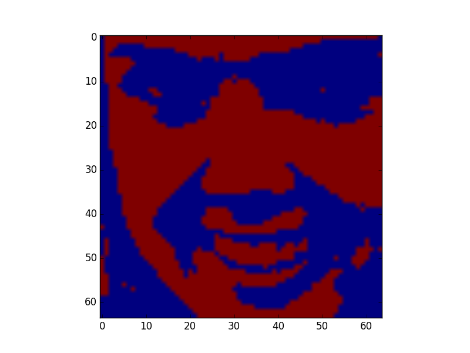
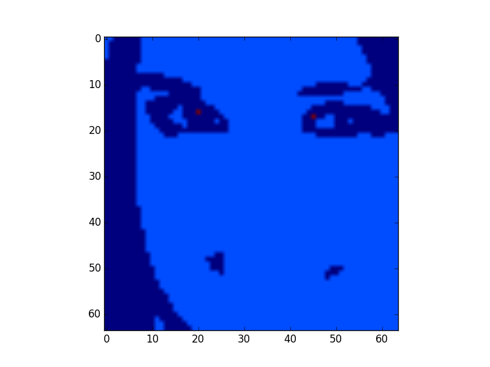

# Face Detection

This repository deals with some stuffs about face detection...

## Requirements

It requires python 2.7 with the following modules :

```
cv2        --> opencv
numpy      --> numerical computation
skimage    --> for computing lbp efficiently
sklearn    --> for machine learning
matplotlib --> for plotting and visualizing
```

## Files

### tools.py

Some usefull functions

### lbp_face_detection_model_training.py

Train a Logistic Regression model to learn to detect faces using the lbp features...
At the end of the training the model is saved as logistic_model.mdl with help th the pickle module...
To train the model :
```bash
python lbp_face_detection_model_training.py
```

### extract.py

Extract faces from the image... this can take a while because no heuristic was made actually and does a lot of matrix multiplcations...
To run it type (once the lbp_model trained) : 
```bash
python extract.py my_image_name.jpg
```

### eyes_detection.py

Try to find where are eyes in the detected face...
The image is first binarized using the k-means algorithm (k=2) to reveal the darkest parts of the images (eyes, mouth, hairs...)



The binarized image is splitted in 4 parts, 2 tops and 2 bottoms, and with 1 cluster k-means on each of the top image, the eyes should be near to the center cluster...



```bash
python eyes_detection.py my_extracted_face.jpg
```


